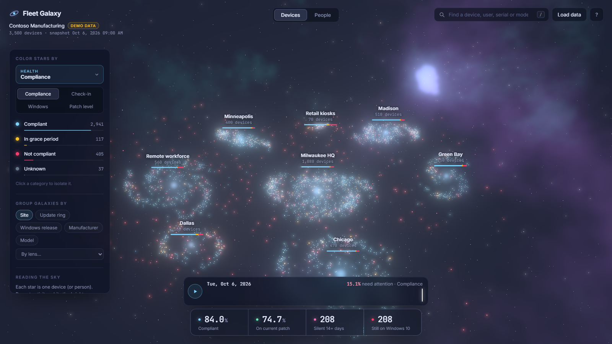
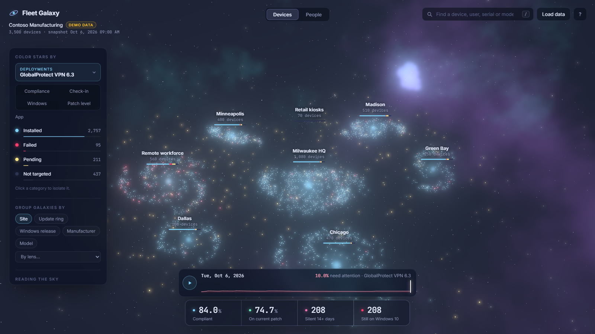
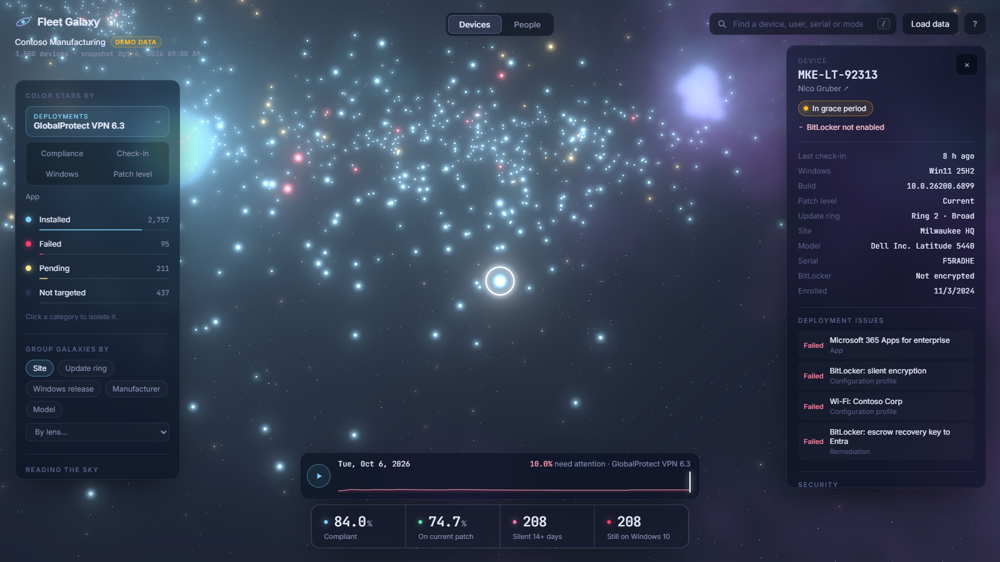
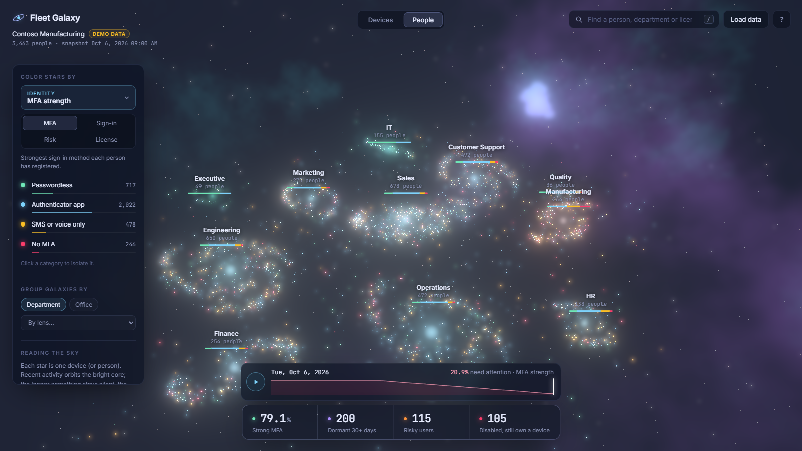
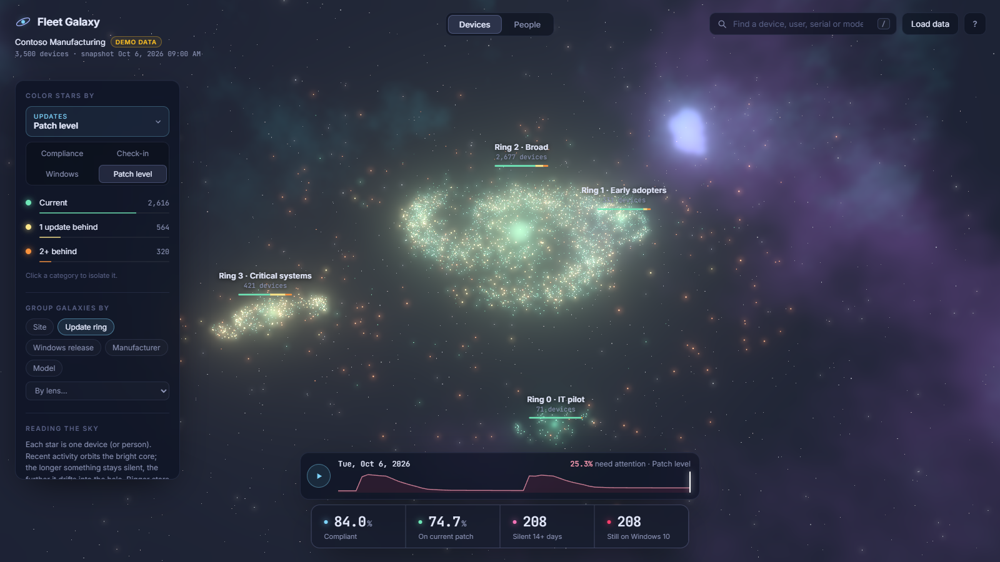
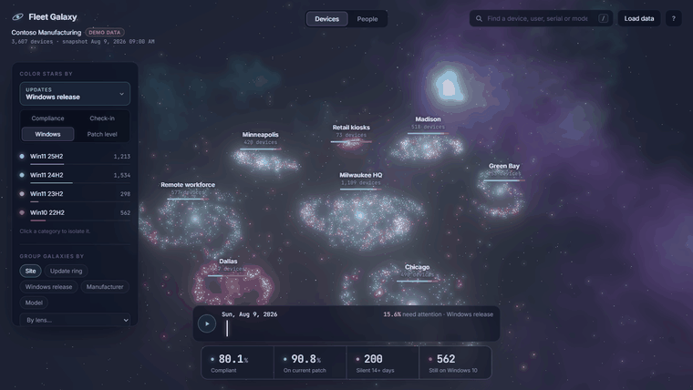

<div align="center">

# Fleet Galaxy

**Your Intune devices and Entra users as a living 3D galaxy.**

Every star is a device or a person. Stale machines drift to the edges, failed deployments glow red,
and a timeline shows you how the fleet got where it is.

[**Download**](https://yeomanlabs.github.io/fleet-galaxy/) · [**Live demo**](https://yeomanlabs.github.io/fleet-galaxy/demo/) · [Permissions and privacy](docs/app-registration.md) · [How it works](#how-it-works)



</div>

## Reading the sky

The layout isn't decoration:

- **Distance from the core is recency.** Devices that synced recently orbit the bright core. Anything silent for a week drifts past the disc edge into the halo, further the longer it's gone. For people, it's their last sign-in.
- **Color is the lens you pick.** There are more than 30, and any custom field becomes one.
- **Size is attention.** Healthy stars are small and quiet. Dim ones have no data.
- **Each galaxy's core glows with its average health,** and the bar under its label shows the mix.

## Lenses

| Group | Lenses |
| --- | --- |
| Health | Compliance (with the failing policies), last check-in, BitLocker |
| Updates | Windows release, patch level, update ring |
| Deployments | One lens per app, configuration profile and remediation: installed, failed, conflict, pending, fixed, recurring |
| Security | Defender device state, active malware, real-time protection, overdue signatures |
| Experience | Endpoint Analytics startup score, boot time, app reliability, battery health |
| Lifecycle | Hardware age, warranty, Windows 11 readiness |
| People | MFA strength, sign-in activity, user risk, license, license clean-up, devices per person |
| Custom | Drop a CSV keyed by device name, serial or UPN. Every column becomes a lens; dates become "days from snapshot" |

<table>
<tr>
<td width="50%"><br><sub><b>Deployments.</b> GlobalProtect is failing mostly in the remote-worker galaxy.</sub></td>
<td width="50%"><br><sub><b>Click any star</b> for failing policies, every unhappy deployment, Defender and Endpoint Analytics data, and a deep link into Intune.</sub></td>
</tr>
<tr>
<td width="50%"><br><sub><b>People.</b> Users grouped by department, colored by MFA strength. Click a person to draw lines between their devices.</sub></td>
<td width="50%"><br><sub><b>Group by anything.</b> Update rings colored by patch level: Ring 3 is visibly behind.</sub></td>
</tr>
</table>

## Time machine

Load several snapshots and a timeline appears. Press play to watch Patch Tuesday roll through your rings, Windows 10 machines turn into Windows 11 stars, new laptops arrive and retired ones fade out. The sparkline shows the current lens's "needs attention" share over time.



The desktop app saves one snapshot per day you refresh, so the history builds itself. The demo ships 60 days of synthetic history.

## Get it

**Desktop app (recommended).** Download it for Windows or macOS from the [download page](https://yeomanlabs.github.io/fleet-galaxy/), click **Sign in with Microsoft**, and your galaxy appears. It works in any tenant and connects to nothing but Microsoft: there's no server and no app registration of its own. It signs in through Microsoft Graph Command Line Tools (Microsoft's own app, already in every tenant), or through [your own app registration](docs/app-registration.md) if you prefer. You choose which data sources to pull, and it only asks for those permissions, all read-only.

**Web version.** The [live demo](https://yeomanlabs.github.io/fleet-galaxy/demo/) runs entirely in your browser. Drop in a `fleet.json` (or several, for a timeline) and it's read locally; nothing is uploaded.

**PowerShell.** `export/Export-FleetGalaxy.ps1` writes a core `fleet.json` (devices, compliance, rings) with read-only Graph scopes, for people who'd rather run a script.

## Privacy

- There is no Fleet Galaxy backend. Data goes from Microsoft Graph to your computer and nowhere else.
- Delegated, read-only permissions: the app sees only what your own Intune and Entra roles allow.
- Tokens are encrypted with Windows DPAPI (Keychain on macOS). Snapshots are gzipped files in your app data folder.
- Intune's bulk report export only accepts ReadWrite permissions, so Fleet Galaxy deliberately doesn't use it. That's why Defender status is read per device and Settings Catalog profile status is left out.
- Exports can be pseudonymized (salted hashes for device names, people and serials) before you share them.

Full permission list, licensing notes and the bring-your-own-registration guide: [docs/app-registration.md](docs/app-registration.md).

## How it works

```
                 ┌──────── desktop app (Electron) ────────┐
Microsoft Graph ─┤ MSAL sign-in → collector → snapshots    ├─► same page as the web demo
 (read-only)     └─────────────────────────────────────────┘
                                                    fleet.json (v2) ─► lenses ─► layout ─► WebGL
```

- **One draw call for the whole fleet.** All stars are a single `THREE.Points` cloud with a custom shader for glow, twinkle, hover rings and arrival flashes. Positions and colors ease on the CPU, which stays cheap at tens of thousands of stars and keeps picking exact.
- **Deterministic layout.** A star's position comes from a hash of its id, so it keeps its place when you regroup or scrub through time.
- **Lens engine.** Built-in facts, well-known fields, deployments and arbitrary custom fields all compile to the same `Lens` interface: categories (healthiest first) and a key per star. Number fields bucket by declared stops or by quantiles.
- **Time machine.** Snapshots are aligned by id, so index *i* is the same device on every day; devices that don't exist yet or were retired get a presence flag of 0 and fade.
- **Collector.** Independent sources (devices, rings, compliance, deployments, Defender, Endpoint Analytics, people, risk). Throttling is retried with `Retry-After`, and a source that's denied for permissions or licensing becomes a warning instead of a failure.
- **Patch level without a release calendar.** Revisions are ranked within each servicing family (24H2 and 25H2 share one), ignoring stray preview builds.

## Keyboard

| Key | Action |
| --- | --- |
| `1`–`4` | Quick lenses |
| `L` | All lenses |
| `G` | Next grouping |
| `P` | Devices / People |
| `/` | Search devices, people, serials, models |
| `Space` | Play the timeline (or pause the orbit) |
| `←` `→` | Step a day |
| `Esc` | Clear selection and filters |

## Development

```bash
npm install
npm run dev          # http://localhost:5175 (landing) and /demo/ (app)
npm test             # vitest: classification, lenses, layout, history, CSV, collector against a fake Graph
npm run build        # typecheck + production build to dist/
npm run desktop      # build and run the desktop app
npm run dist:win     # Windows installer → release/Fleet-Galaxy-Setup.exe
npm run capture      # regenerate screenshots and timeline.gif (needs the dev server and Edge)
```

Releases: push a `v*` tag and GitHub Actions builds the Windows installer and the macOS dmg and attaches them to a release.

## Status

- The page, demo data, lens engine, time machine and desktop shell are tested: 34 unit tests, plus visual checks on desktop and mobile and a packaged-app smoke test.
- The collector's Graph endpoints were checked against Microsoft's documentation, are tested against a mocked Graph, and have run against a small live tenant (devices, rings, apps, Defender, people with MFA, sign-ins and licenses all returned real data). Endpoint Analytics, profile and remediation results haven't been seen with real data yet, and nothing has run at enterprise scale. Issues and PRs welcome.
- Installers aren't code-signed yet, so Windows SmartScreen and macOS Gatekeeper will warn on first run.

## Related

[i9s](https://github.com/YeomanLabs/i9s) is the same tenant in your terminal: a k9s-style, keyboard-driven UI for devices, people and apps, with sync and restart.

## License

MIT. See [LICENSE](LICENSE).
