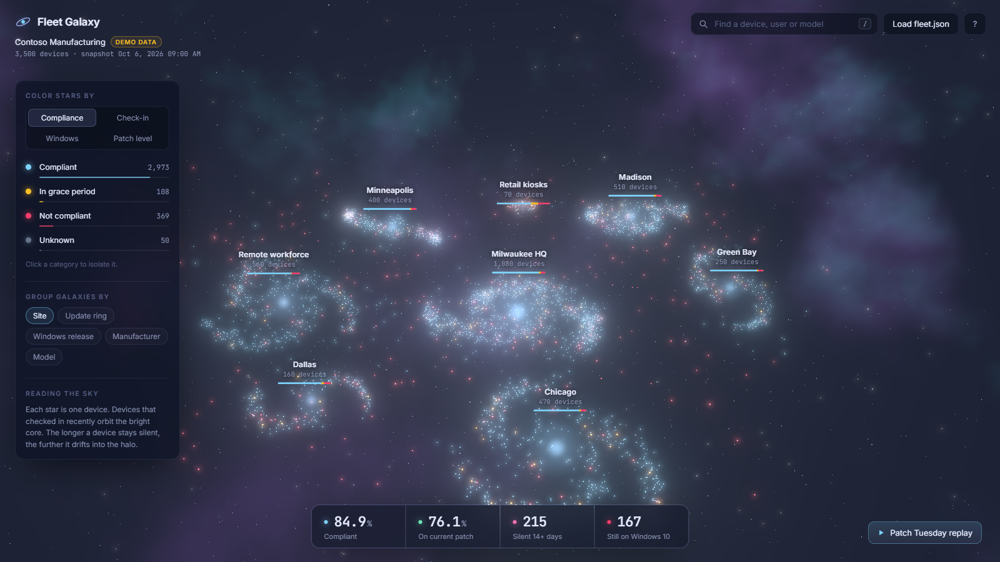
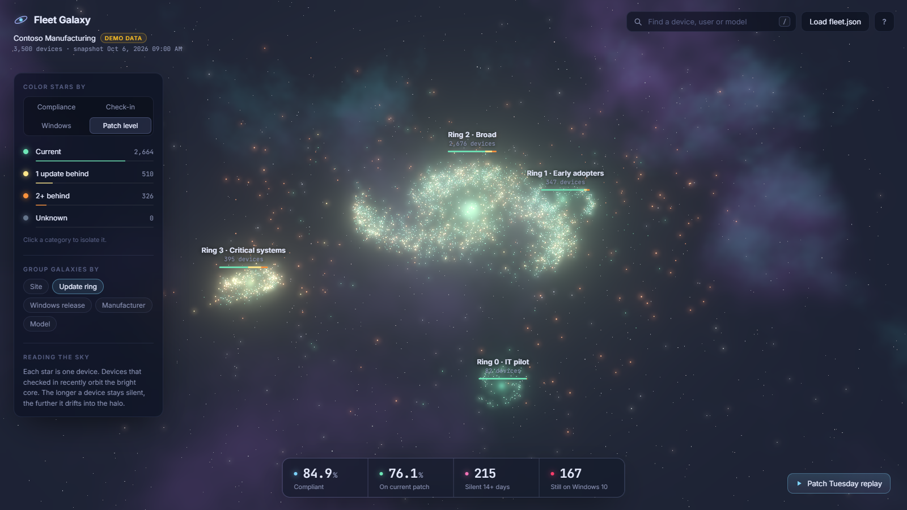
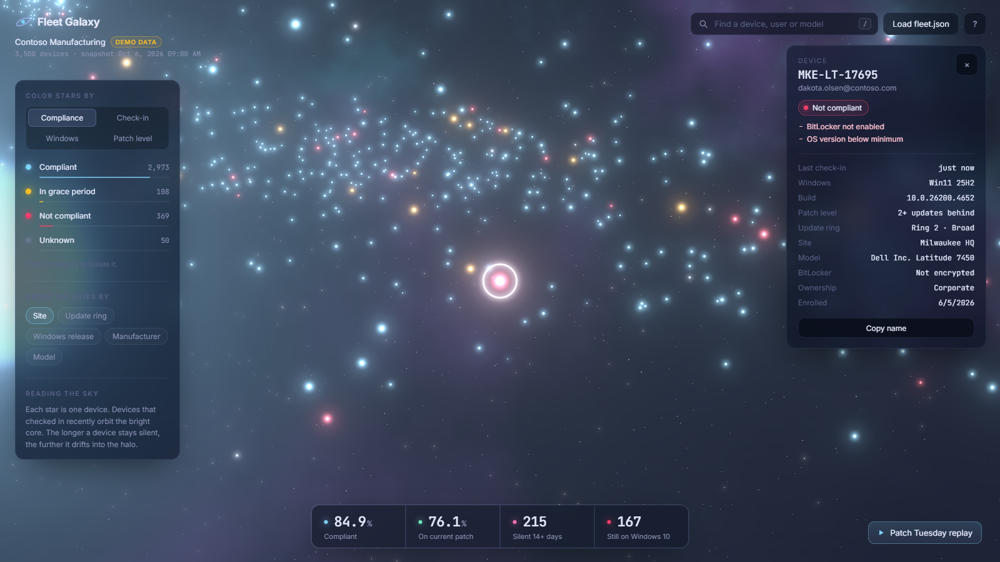
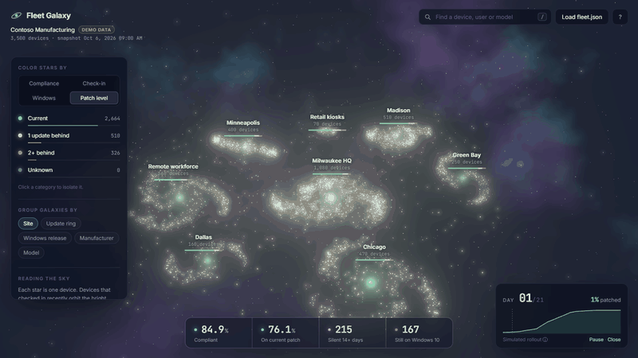

<div align="center">

# Fleet Galaxy

**Your Intune-managed Windows fleet as a living 3D galaxy.**

Every star is a device. Every galaxy is a site, update ring, model or Windows release.
Spot the stragglers, watch Patch Tuesday roll through your rings, and click any star to see why it's red.

[**Live demo →**](https://yeomanlabs.github.io/fleet-galaxy/) · [Use your own tenant](#your-own-fleet) · [How it works](#how-it-works)



</div>

## Reading the sky

The layout isn't decoration. Where a star sits tells you something:

- **Distance from the core is check-in recency.** Devices that synced in the last week orbit the bright core in spiral arms. A device that's been silent for 7+ days drifts past the disc edge into the halo, further the longer it's gone. Stale devices are visible at a glance as the scattered stars around each galaxy.
- **Color is whatever you're asking about:** compliance, last check-in, Windows release or patch level.
- **Bigger stars need attention.** Healthy devices are small and quiet; non-compliant, behind or stale devices are larger.
- **Each galaxy's core glows with its average health,** and the bar under its label shows the mix.

<table>
<tr>
<td width="50%"><br><sub><b>Group by update ring, color by patch level.</b> Ring 3 (critical systems) is visibly behind.</sub></td>
<td width="50%"><br><sub><b>Click any star.</b> Failing compliance policies, build, ring, last check-in, and a deep link into Intune.</sub></td>
</tr>
</table>

## Patch Tuesday replay

Press **R** and watch this month's cumulative update ripple through the fleet: pilot first, then early adopters, then broad, outward from each galaxy's core, with a live adoption curve.



> The replay is a **projection**, and the UI labels it as one. `fleet.json` carries no install history, so it's simulated from each device's ring, check-in habits and current patch level. Devices that are behind today never "install" in the replay.

## Your own fleet

Fleet Galaxy is a static page. Your data never leaves your machine: you export a `fleet.json` and drop it onto the page, and it's read locally in your browser.

```powershell
# PowerShell 7.2+, Microsoft.Graph.Authentication module
./export/Export-FleetGalaxy.ps1
```

Then open the [live demo](https://yeomanlabs.github.io/fleet-galaxy/) (or your own copy) and drag `fleet.json` onto it.

| Option | What it does |
| --- | --- |
| `-Anonymize` | Hashes device names and drops users and the tenant name, so you can share screenshots or the file. |
| `-SiteSource NamePrefix -SiteNames @{ MKE = 'Milwaukee' }` | Groups by a device-name prefix instead of Intune device category. `-SitePattern` takes your own regex. |
| `-RingGroups ([ordered]@{ Pilot = '<groupId>'; Broad = '<groupId>' })` | Maps rings yourself. By default, rings are detected from your Windows Update for Business ring policies and ordered by quality update deferral. |
| `-IncludeReasons` | Fetches which compliance policies each non-compliant device fails (one extra call per device). |
| `-SkipRings` | Leaves rings out entirely. |

**Permissions (all read-only, delegated):**

| Scope | Why |
| --- | --- |
| `DeviceManagementManagedDevices.Read.All` | The device list |
| `DeviceManagementConfiguration.Read.All` | Update ring policies, compliance policy states |
| `GroupMember.Read.All` | Ring group membership |

The `fleet.json` format is documented in [`src/data/types.ts`](src/data/types.ts). Anything that produces it works: a ConfigMgr query, a CSV conversion, another MDM.

## How it works

```
Export-FleetGalaxy.ps1 ──► fleet.json ──► drop on page ──► parseFleet() ──► classify ──► layout ──► WebGL
   (Graph, read-only)                       (in browser)     (validate)     (patch rank,   (spiral   (one Points
                                                                              check-in age)  galaxies)  draw call)
```

- **One draw call for the whole fleet.** All devices are a single `THREE.Points` cloud with a custom shader for glow, twinkle, hover rings and the replay flash. Positions and colors ease on the CPU, which stays cheap at tens of thousands of devices and keeps picking exact.
- **Layout is deterministic.** Each device's position comes from a hash of its id, so a device keeps its place in its arm when you regroup, and screenshots are reproducible.
- **Patch level without a release calendar.** Revisions are ranked within each servicing family (24H2 and 25H2 share one), ignoring stray preview or out-of-band builds below a 0.5% share. "Current" means the newest revision a meaningful part of the fleet runs.
- **Postprocessing:** Unreal bloom over the star field, an fbm-noise nebula on a backdrop sphere, and CSS2D labels.
- **The demo fleet** is generated in the browser from a fixed seed: 3,500 fictional devices at "Contoso Manufacturing", with site personalities (Dallas holds on to Windows 10, remote workers check in less often, kiosks sit in the critical ring).

## Keyboard

| Key | Action |
| --- | --- |
| `1`–`4` | Color by compliance / check-in / Windows release / patch level |
| `G` | Next grouping |
| `/` | Search devices, users, models |
| `R` | Patch Tuesday replay |
| `Space` | Pause the slow orbit |
| `Esc` | Clear selection and filters |

Click a legend entry to isolate it (Shift+click to toggle). Click a KPI to jump to the devices behind it.

## Development

```bash
npm install
npm run dev        # http://localhost:5175
npm test           # vitest
npm run build      # typecheck + production build to dist/
npm run capture    # regenerate docs/ screenshots and replay.gif (needs the dev server and Edge)
```

Built with TypeScript, three.js and Vite. No framework, no backend.

## Status

- The page and demo fleet are tested (unit tests for classification, layout, loader and replay; visual checks on desktop and mobile).
- `Export-FleetGalaxy.ps1` has been tested against a mocked Graph (paging, ring detection from device and user groups, exclusions, anonymization) and run successfully against a small live tenant. It hasn't been run at enterprise scale yet; issues and PRs welcome.

## License

MIT © YeomanLabs
